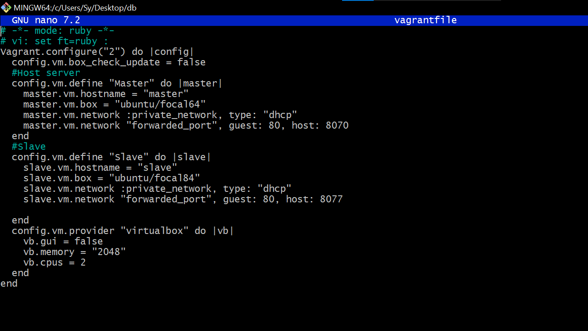
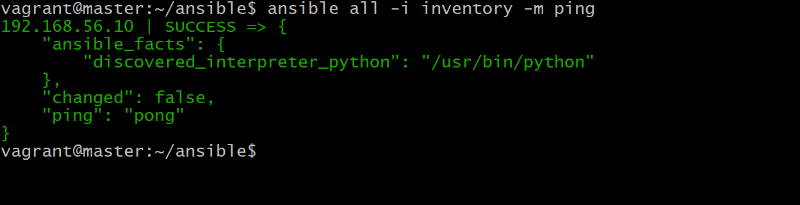

# Cloud Engineering Second Semester Examination Project

## (Deploy LAMP Stack)

## Objective
Automate the provisioning of two Ubuntu-based servers, named “Master” and “Slave”, using Vagrant.
On the Master node, create a bash script to automate the deployment of a LAMP (Linux, Apache, MySQL, PHP) stack.
This script should clone a PHP application from GitHub, install all necessary packages, and configure Apache web server and MySQL. 
Ensure the bash script is reusable and readable.
Using an Ansible playbook:
Execute the bash script on the Slave node and verify that the PHP application is accessible through the VM’s IP address (take screenshot of this as evidence)
Create a cron job to check the server’s uptime every 12 am.

To accomplish the objective, we'll follow these steps:

Set up two Ubuntu-based servers named "Master" and "Slave" using Vagrant.
Create a bash script to automate the deployment of a LAMP stack on the Master node.
Use an Ansible playbook to execute the bash script on the Slave node and verify the accessibility of a PHP application.
Create a cron job to check the server's uptime every day at 12 am on the Slave node.
Let's start with step-by-step implementation:

Step 1: Set up the servers using Vagrant
Ensure you have Vagrant installed on your system. Then, create a Vagrantfile with the following configuration:

Step 2: Create a bash script for LAMP stack deployment on the Master node
Create a bash script named automate.sh

Purpose:

This script automates the process of setting up a Laravel application on a Linux system with Apache web server and a MySQL database.

Steps:

System Updates and Package Installation:

Updates the package lists (sudo apt update -y).
Installs Apache web server (sudo apt install apache2 -y).
Adds the Ondřej repository for PHP 8.2 (sudo add-apt-repository ppa:ondrej/php -y).
Updates the package lists again (sudo apt update -y).
Installs PHP 8.2 (sudo apt install php8.2 -y).
Installs necessary PHP dependencies for Laravel (sudo apt install php8.2-curl php8.2-dom php8.2-mbstring php8.2-xml php8.2-mysql).
Apache Configuration:

Enables Apache rewrite module (sudo a2enmod rewrite).
Restarts Apache server (sudo systemctl restart apache2).
Composer Installation:

Installs Composer globally (install composer globally -y). (Note: This line might need modification depending on your system's package manager.)
Downloads Composer installer (sudo curl -sS https://getcomposer.org/installer | sudo php -q).
Moves the downloaded installer to composer (sudo mv composer.phar composer).
Laravel Project Setup:

Navigates to the /var/www directory (cd /var/www/).
Clones the Laravel repository from GitHub (sudo git clone https://github.com/laravel/laravel.git).
Sets ownership of the Laravel directory to the current user (sudo chown -R $USER:$USER /var/www/laravel).
Navigates to the Laravel project directory (cd laravel/).
Installs Composer dependencies in production mode (composer install --optimize-autoloader --no-dev --no-interaction).
Updates Composer dependencies (composer update --no-interaction).
Copies the .env.example file to .env (sudo cp .env.example .env).
Sets ownership of storage and bootstrap/cache directories to the web server user (sudo chown -R www-data storage sudo chown -R www-data bootstrap/cache).
Apache Virtual Host Configuration:

Creates a new virtual host configuration file (sudo touch latest.conf).

Defines the virtual host configuration for the Laravel application (sudo echo ... | sudo tee /etc/apache2/sites-available/latest.conf). This configuration includes:

Server name: localhost
Document root: /var/www/laravel/public
AllowOverride All for the Laravel directory
Error logs and access logs
Enables the new virtual host (sudo a2ensite latest.conf).

Disables the default virtual host (sudo a2dissite 000-default.conf).

Restarts Apache server (sudo systemctl restart apache2).

MySQL Database Setup:

Installs MySQL server (sudo apt install mysql-server -y).
Installs MySQL client (sudo apt install mysql-client -y).
Starts the MySQL service (sudo systemctl start mysql).
Creates a MySQL database named goodydb (sudo mysql -uroot -e "CREATE DATABASE goodydb;").
Creates a MySQL user coder29 with the password secured23 (sudo mysql -uroot -e "CREATE USER 'coder29'@'localhost' IDENTIFIED BY 'secured23';").
Grants all privileges on the goodydb database to the user coder29 (sudo mysql -uroot -e "GRANT ALL PRIVILEGES ON goodydb.* TO 'coder29'@'localhost';").
Laravel Application Configuration:

Navigates to the Laravel project directory (cd /var/www/laravel).
Updates the .env file with the following changes using sed:
Enables MySQL database connection (sudo sed -i '22 s/=sqlite/=mysql/' /var/www/laravel/.env).
Updates database host to localhost (sudo sed -i '23 s/=127.0.0.1/=localhost/' /var/www/laravel/.env).
Keeps the default port (3306)

Step 3: Create an Ansible playbook to execute the bash script on the Slave node
Create an Ansible playbook named deploy.yml with the following content:
Step 4: Ping the slave sever to ensure connect with slave

Step 4: Verify PHP application accessibility and take a screenshot as evidence
Access the PHP application through the Slave node's IP address using a web browser.

